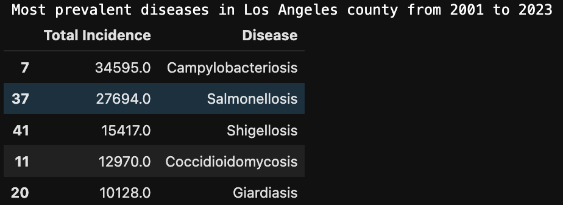
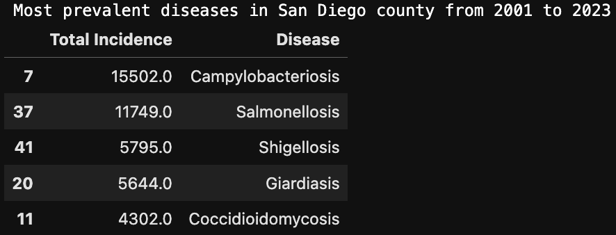
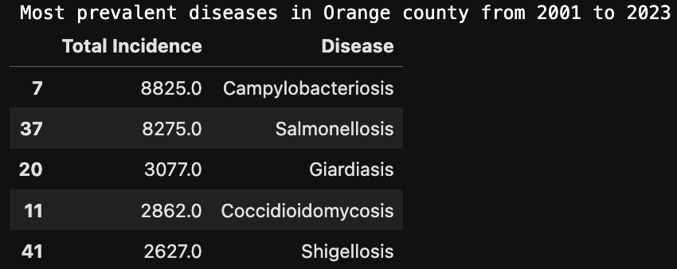
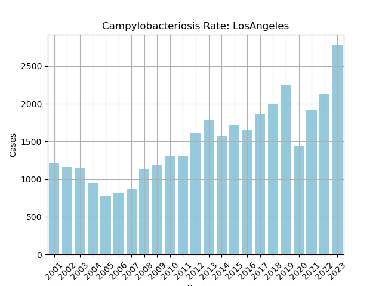
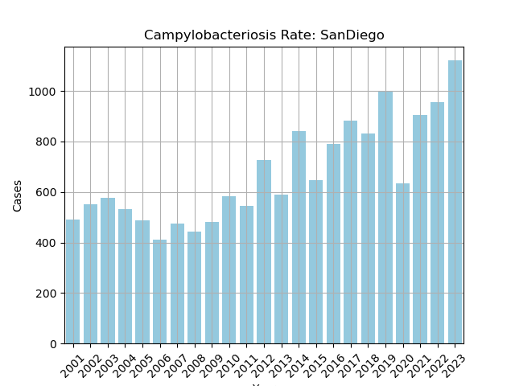
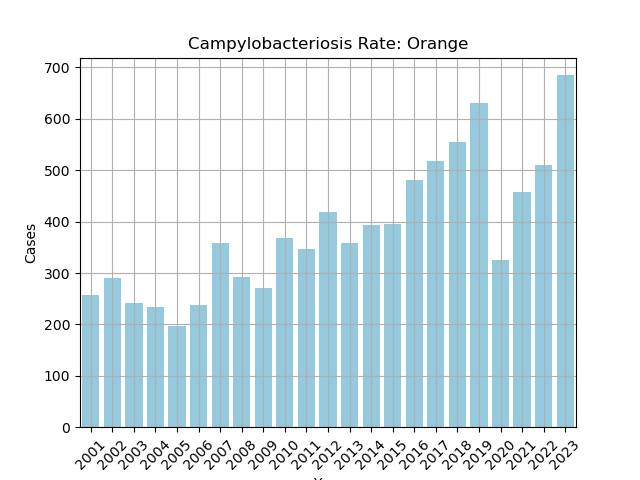
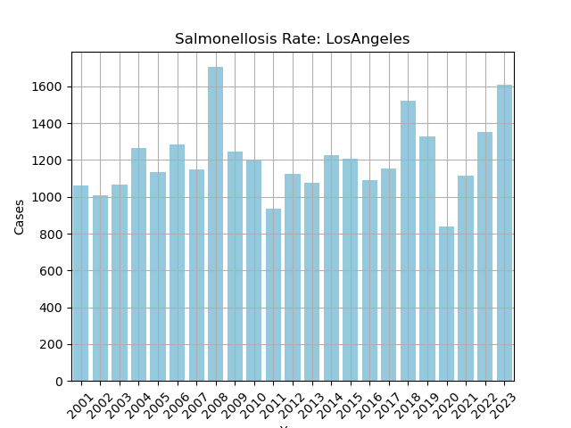
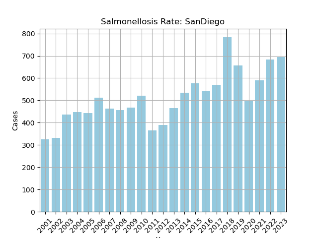
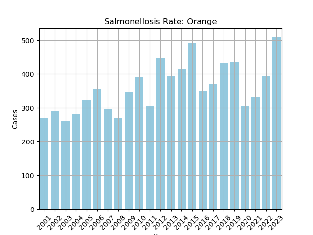

# Improving public health in the state of California by identifying it's most common infectious diseases

In this git repo, I perform analysis of an open source data set by the state of California to identify the most prevalent disease affecting californians between the years of 2001 and 2023. And use this to draw insights on where to best direct resources

The dataset was obtained from chhs.ca.gov: https://data.chhs.ca.gov/gl/dataset/infectious-disease

# Desired Insights
1. What disease is the most prevalent in a given county, throught the period of the dataset, and in a given year # Decide where to allocate resources
2. Which population is most afflicted by a given disease, sex?                                                   # Identify the at risk groups for a disease, 
3. What counties have the most total disease rate          # Identify the at risk counties and provide public health information to reduce spread
4. Total disease rate per county per year                  # Identify which county is most disease prone, understand what disease and why potentially
5. The progression of case rate per year, per county       # Use this to identify and measure a potential outbreak risk 


# Results in progress
Through processing this dataset with Pandas and Seaborn, I was able to identify the infectious disease afflicting any given county from the years of 2001 - 2023 in the state of California. Below are the most common infectious diseases for the 3 most populous counties, Los Angeles, San Diego and Orange. The most prevalent disease was revealed to be [Campylobacteriosis](https://www.cdc.gov/campylobacter/about/index.html) which is a bacterial infection that causes diarrhea, caused by the Campylobacter bacteria most commonly contracted by consuming under cooked poultry. 


| Los Angeles County |  San Diego County |Orange County |
|--------------------|--------------|------------------|
|  |  |  | 
|  |  |  |
|  |  |  |

From these plots we can observe that the incidence rate of Campylobacteriosis is on a steady incline, while [Salmonellosis](https://www.cdc.gov/salmonella/about/index.html) sees only slight growth. We observe a slight reduction in the number of cases during the year 2020 in both diseases, no doubt caused by the under-reporting of cases during the height of the COVID-19 pandemic, or by the potential reduced consumption of poultry in this same period. 


# Actionable insights
Given that the top 2 infectious diseases in these counties are food borne illnesses, perhaps a public health announcement on how to properly prepare poultry for consumption would help curb the incidence rate of this disease. (*Not adjusted for growth in population throughout this period)

# Set up the work environment

```
git clone git@github.com:Jcardenas34/infectious_disease.git
cd infectious_disease
wget https://data.chhs.ca.gov/gl/dataset/infectious-disease/odp_idb_2001-2023_ddg_compliant.csv
```
Most of the work has been done in the [infectious_disease_incidence_rate_per_county_per_year.ipynb](./infectious_disease_incidence_rate_per_county_per_year.ipynb)
jupyter notebook
